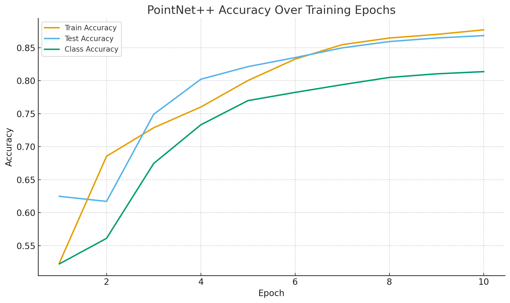
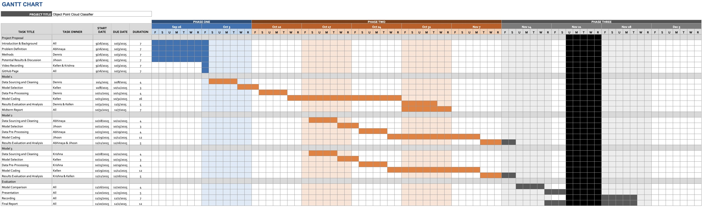
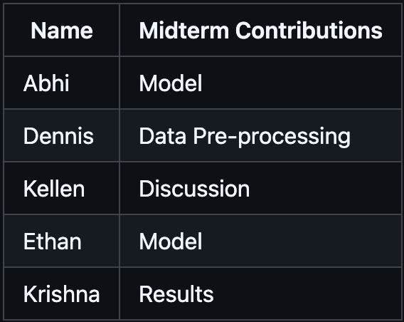

# ML-Project
## Introduction/Background
Capturing information about the world is the ultimate goal of any data prediction model- first observe current conditions, then develop reasoning about the world. Data collection comes in all forms, from text input to video recordings. To capture the world in 3D as it actually exists is a challenge on its own, with 2D media not being sufficient to actually model real environments. Hence, LiDAR sensors have been the primary technology used to collect dimensional data in order to simulate the real world environment because they capture and encode distance from source to surroundings objects, beating out the compressed data that traditional 2D videos have traditionally captured.
## Problem Definition
LiDAR is at the forefront of technology used to digitally navigate the real world. Applications range from simple AR on mobile devices to physically navigating autonomous vehicles quickly and safely [1]. Further applications of point clouds can assist retaining physical information that could be lost in the scanning process [2].  However, the data amassed by these sensors necessitate additional methods to actually make use of it [3]. Techniques utilizing segmentation can help with optimizing classification and identifying local point cloud structures [4]. We seek to utilize point clouds to normalize data and equalize sensors’ perceptions of the world to build an accurate mental model in the computational system. We also seek to quickly identify and classify objects using data about the 3D world. To verify our solutions to these problems we will track quantitative metrics that give us insight into model accuracy and speed.
## Methods Overview
Data Preprocessing:
- Point Cloud Normalization 
  - pc_normalize()
  - It is from the PointNet++ repo
  - Ensures consistent scale and position across samples, improving model generalization
     
Machine Learning Models/Algorithms:
- PointNet++
  - Class: PointNet2ClassificationSSG
  - PointNetPlusClassifier() in PyTorch/ Matlab
- PointMLP
- DGCNN

## 1 Data Preprocessing Method
    def pc_normalize(pc): 

      l = pc.shape[0]
      centroid = np.mean(pc, axis=0)
      pc = pc - centroid
      m = np.max(np.sqrt(np.sum(pc**2, axis=1)))
      pc = pc / m
      
      return pc

pc_normalize(pc) normalizes the point clouds by centering it at the origin and scaling it so that all points fit inside a unit sphere. It does this by subtracting the centroid and dividing by the maximum distance from the origin. This makes the point clouds smaller and uniformly scaled around the center. We chose this because it was recommended by the authors who created the PointNet++ model.

## 3 Chosen Models

For our first model, we chose the open source PointNet++ model (repo attached within our directories) on our LiDar point cloud data. It is a supervised model that is widely popular for training on LiDar data for classification purposes. It also works best with large, diverse data sets, which is the case with the data of our choice. Our goal for this project was to capture local features and relationships in LiDAR point clouds (semantic segmentation), a key feature of PointNet++ among it's other strengths.

For our second model, we implemented DGCNN (Dynamic Graph CNN), another supervised model commonly used in point cloud understanding. DGCNN builds a dynamic k-nearest-neighbor graph at each layer, allowing it to capture fine-grained geometric relationships between points. This makes it particularly effective for segmentation tasks where local neighborhood structure is important. By continuously updating the graph as features evolve, DGCNN adapts to complex shapes in LiDAR data and can learn more expressive local descriptors than static graph approaches.

For our third model, we selected PointMLP, a supervised MLP-based model designed to avoid heavy reliance on convolutions or graph operations. PointMLP focuses on efficient per-point feature extraction and uses residual MLP blocks with geometric affine transformations to improve robustness to variations in point distributions. It is known for its strong performance on large-scale point cloud datasets and its relatively simple, fast inference. For our project, PointMLP serves as a comparison to graph-based and hierarchical models, letting us evaluate how an MLP-driven method handles semantic segmentation of LiDAR data.

## Results and Discussion
Quantitative Metrics: 
- F1 Score
  - Indicates how well points are classified and sorted into the correct classes.
- Accuracy
  - Tells us how well the models has learned local structures in relation to global structure.
- Precision
  - How fine the local geometry is captures leading to correct class predictions.

## [Why our models performed well and what are the next steps we plan to take?] 

The results across classification, part segmentation, and semantic segmentation show that PointNet++ consistently outperforms PointNet. When classifying on the ModelNet dataset, PointNet++, especially the MSG model, achieves the highest accuracy (92.8%), which shows that learning local structure leads to better overall shape recognition. For part segmentation, PointNet++ has higher instance and class IoU, demonstrating higher ability to capture small details that separate object parts. On S3DIS semantic segmentation, PointNet++ raises class-average IoU from 43.7% to 53.5%, showing more consistent performance across different categories. Overall, the results show that learning local features at multiple scales leads to more accurate and reliable 3D understanding than the original PointNet.

Results for second model here

Results for third model here

All in all, the PointNet++ model is **solid but not stellar**. We are currently seeing ~0.99 train instance accuracy against the ~0.92 test instance accuracy (best ~0.929) with class accuracy ~0.90, which points to decent learning plus a modest generalization gap and likely class imbalance (where: instance > class). It is perfecetly usable; however, some classes are clearly underperfoming and later epochs do not improve on the earlier best, suggesting we are overfitting or under-augmenting for our lighter point clouds. (i.e., sparser samples with fewer points per object and more local noise, so the train distribution is denser than what we evaluate on).

**The next steps we are intending to take are as follows:**

- *Strengthen augmentation*: random z-rotations, scaling, jitter, and point dropout to increase pose and density variance. This will build invariance to missing points and viewpoint changes, improving robustness across densities.

- *Loss rebalancing*: add class weighting or focal loss to lift rare/weak classes. This will reduce bias toward frequent classes.

- *Regularization and Training Schedule*: weight decay, dropout, label smoothing, early stopping on best value, and a cosine LR with warmup. This will lower variance and stabilize training so we keep the best-generalizing checkpoint instead of overfitting late.

- *Diagnostics*: compute a per-class confusion matrix and a targeted error breakdown. This will turn tuning from guesswork into more focused and deliberate fixes.

- *Data/Features*: rebalance the dataset by oversampling or collecting more examples for rare classes. The will hopefully increase their representation, improve the per-class recall and macro accuracy, as well as leading to more consistent performance across different datasets.

>This plan should narrow the generalization gap and bring per-class accuracy closer to the instance score, yielding a more reliable PointNet++ on sparse/light clouds.

## Gantt Chart

## Contribution Table

## Project Goals
- Latency: Minimize time taken to classify an object
  - Preprocessing techniques can help minimize latency ensuring objects get recognized within a few moments of being seen
- Accuracy: Successfully achieve high classification
  - The objects should be classified as the object that it is, with low rates of error

## Expected Results:
- A working object classification system that can classify objects with high accuracy
- Measure improvements in performance from data preprocessing

## References
[1] C. Vishnu, J. Khandelwal, C. K. Mohan and C. L. Reddy, “EVAA–Exchange Vanishing Adversarial Attack on LiDAR Point Clouds in Autonomous Vehicles,” IEEE Trans. Geosci. Remote Sens., vol. 61, 2023, Art. no. 5703410, doi: 10.1109/TGRS.2023.3292372.

[2] J. Park and Y. K. Cho, “Point Cloud Information Modeling: Deep Learning–Based Automated Information Modeling Framework for Point Cloud Data,” J. Construct. Eng. Manage., vol. 148, no. 2, Art. no. 04021191, 2022, doi: 10.1061/(ASCE)CO.1943-7862.0002227.

[3] M. Hao et al., “Coarse to fine-based image–point cloud fusion network for 3D object detection,” Information Fusion, vol. 112, p. 102551, Dec. 2024. doi:10.1016/j.inffus.2024.102551 

[4] H. Ni, X. Lin and J. Zhang, “Classification of ALS Point Cloud with Improved Point Cloud Segmentation and Random Forests,” Remote Sens. (Basel, Switzerland), vol. 9, no. 3, Art. no. 288, 2017, doi: 10.3390/rs9030288.

## Repo Structure

`/classification_ModelNet40/`: Training and evaluation pipeline for ModelNet40 point-cloud classification.

`/classification_ModelNet40/models/`: Contains model definitions.

`/classification_ModelNet40/models/__init__.py`: Initializes model imports.

`/classification_ModelNet40/models/pointmlp.py`: Full PointMLP architecture (sampling, KNN grouping, residual MLP blocks, classifier).

`/classification_ModelNet40/utils/`: Utility scripts for training/testing.

`/classification_ModelNet40/utils/progress.py`: Progress bar utilities.

`/classification_ModelNet40/utils/logger.py`: Logs accuracy, loss, and LR.

`/classification_ModelNet40/utils/misc.py`: RNG seeding, accuracy functions, timers.

`/classification_ModelNet40/utils/__init__.py`: Utility initialization.

`/classification_ModelNet40/data.py`: Loads and processes ModelNet40.

`/classification_ModelNet40/helper.py`: Loss functions & evaluation utilities.

`/classification_ModelNet40/main.py`: Main training script.

`/classification_ModelNet40/test.py`: Evaluation script for trained models.

`/classification_ModelNet40/voting.py`: Multi-view voting (random rotations/scaling).

`/classification_ModelNet40/Log.txt`: Summarized training log.

`/classification_ModelNet40/out.txt`: Full terminal output during training.

`/classification_ScanObjectNN/`: Classification pipeline for the ScanObjectNN dataset.

`/images/`: Images used for documentation, model visualization, and README assets.

`/part_segmentation/`: Point-cloud part segmentation using ShapeNetPart.

`/pointnet2_ops_lib/`: CUDA extension library for KNN, FPS, and grouping operations.

`/pointnet2_ops_lib/pointnet2_ops/`: CUDA kernels.

`/pointnet2_ops_lib/setup.py`: Build script for CUDA ops.

`/analysis.py`: Script for visualization, debugging, and experimental analysis.

`/environment.yml`: Default environment file provided by authors.

`/environment_Dennis.yml`: Custom PACE ICE environment (stabler dependencies).

`/Overview.pdf`: PDF explaining the PointMLP architecture.

`/Overview.png`: Image version of the model overview.

`/requirements.txt`: Python dependencies needed to run the project.

`/README.me`: Original documentation for running models.

`/LICENSE`: Open-source license for this repository.

`/.gitignore`: Prevents large files (logs, checkpoints) from being committed.
